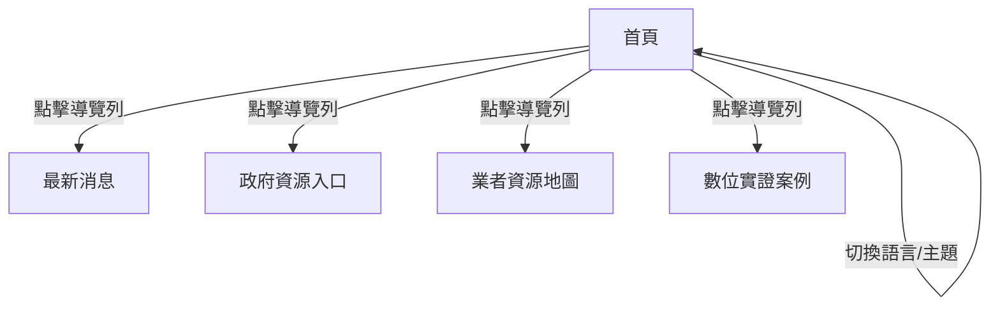

# 數位基礎建設應用平台 BRD v1.0

## 1. 文檔信息

| 版本 | 日期       | 說明           | 編寫人         |
|------|------------|----------------|----------------|
| 1.0  | 2024-06-09 | 首版草稿       | AI 產品策略顧問 |

- **分發對象**：產品經理、開發團隊、UI/UX 設計師、測試人員、業務單位

---

## 2. 項目概述

### 2.1 專案描述
本專案為「數位基礎建設應用平台」網站，聚焦於強化台灣數位產業核心競爭力，促進公私部門合作，推動數位基礎建設應用。

### 2.2 業務目標
- 彙整並展示數位產業三大核心（算力、數據、程式碼）相關資訊
- 提供產業最新消息、政府資源、業者地圖、數位實證案例等入口
- 支援多語系與深色模式，提升易用性與可及性

### 2.3 用戶群體
- 政府部門決策者
- 數位產業業者
- 一般大眾、開發者、學研單位

---

## 3. 功能需求

### 3.1 核心功能
- **首頁主視覺（Hero）**：介紹平台宗旨與三大核心（算力、數據、程式碼）
- **導覽列（NavBar）**：全站導覽、語言切換（中/英）、深色/淺色主題切換
- **最新消息（News）**：展示最新產業消息（目前為靜態佔位，尚無 API 串接）
- **主題切換（ThemeProvider）**：支援系統主題自動切換

### 3.2 次要功能
- **外部平台按鈕**：AI、GitHub、HuggingFace（目前僅圖示，無實際連結）
- **多語系切換**：UI 按鈕切換語言（內容尚未多語化）
- **預留區塊**：政府資源入口、業者資源地圖、數位實證案例（目前無內容）

### 3.3 使用者故事 / 使用場景
- 作為一名產業決策者，我希望能快速了解數位基礎建設的三大核心與最新動態。
- 作為一名開發者，我希望能切換深色模式，提升瀏覽體驗。
- 作為一名一般用戶，我希望能透過導覽列進入不同主題區塊。

---

## 4. 用戶界面需求

### 4.1 界面簡要
- **首頁**：主視覺區塊（Hero），下方可擴充其他內容
- **導覽列**：Logo、平台名稱、主題切換、語言切換、外部平台按鈕、主選單（最新消息、政府資源、業者地圖、實證案例）
- **最新消息頁**：標題＋靜態佔位訊息

### 4.2 流程圖

> 註：B2/B3/B4 目前為預留空頁

---

## 5. 系統需求

### 5.1 架構
- 前端：Next.js（App Router 架構）
- 樣式：Tailwind CSS
- 主題管理：next-themes
- 圖片處理：next/image
- 無後端、無 API 串接（僅靜態頁面）

### 5.2 技術棧
- TypeScript
- React
- Next.js
- Tailwind CSS

### 5.3 外部整合
- 無（僅預留外部平台按鈕，未實作串接）

---

## 6. 數據需求

### 6.1 資料模型概要
- 無資料模型、無資料儲存（所有內容皆為靜態）

### 6.2 資料儲存
- 無（未見任何本地或遠端資料儲存）

### 6.3 資料處理
- 無（無資料流、無 API 呼叫）

---

## 7. 非功能性需求

| 項目         | 指標/說明                                   |
|--------------|---------------------------------------------|
| 性能         | 首頁靜態渲染，預期載入時間 < 2 秒           |
| 安全         | 無用戶資料、無登入，無需特殊安全措施        |
| 可擴展性     | 架構可擴充新頁面與功能                      |
| 維護性       | 採用模組化元件，易於維護與擴充              |
| 無障礙       | 註解提及 aria、focus trap，尚未全面實作      |
| 多語系       | 僅 UI 切換，內容尚未多語化                   |

---

## 8. 實施計劃

| 里程碑             | 內容說明                         | 優先級 | 測試計畫         |
|--------------------|----------------------------------|--------|------------------|
| 1. 首頁主視覺      | Hero 元件、三大核心說明          | 高     | UI 測試          |
| 2. 導覽列          | NavBar、主題/語言切換            | 高     | 功能測試         |
| 3. 最新消息頁      | News 靜態頁                      | 中     | UI 測試          |
| 4. 預留區塊        | 政府資源、業者地圖、實證案例      | 低     | 無               |
| 5. 無障礙優化      | aria、focus trap 實作             | 中     | 無障礙測試       |
| 6. 多語系內容      | 內容多語化                       | 低     | 語言切換測試     |

---

## 9. 術語表

| 術語         | 定義                                                         |
|--------------|-------------------------------------------------------------|
| Hero         | 首頁主視覺區塊，強調平台宗旨與三大核心                       |
| NavBar       | 網站導覽列，含主選單、主題/語言切換、外部平台按鈕            |
| ThemeProvider| 提供全站主題（深色/淺色）切換的元件                          |
| next-themes  | React 主題切換函式庫                                         |
| Tailwind CSS | 實用型 CSS 框架，用於快速設計響應式 UI                       |
| Next.js      | React 應用框架，支援 SSR 與 SSG                              |

---

## 10. 簽署確認

| 職稱         | 姓名     | 日期       | 簽名   |
|--------------|----------|------------|--------|
| 產品經理     |          |            |        |
| 技術負責人   |          |            |        |
| UI/UX 設計師 |          |            |        |

---

## 自我檢查清單

- [x] 追溯性：所有需求均可對應現有程式碼，無臆測未來功能
- [x] 完整性：涵蓋所有現有頁面、元件、樣式與功能
- [x] 量化指標：性能、維護性、可擴展性等均有明確描述
- [x] 澄清流程：如有資訊不足，已於前述澄清清單提出
- [x] 章節結構：依規範完整分章，表格列寬適中

---

如需補充或有新需求，請依據本 BRD 進行修訂與追蹤。 