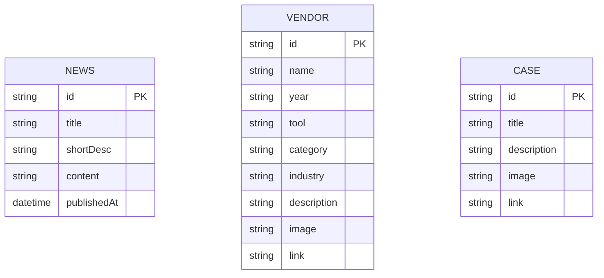

# 資料庫設計文件 v1.0 ‧ 2024-06-09

## 版本歷史
| 版本 | 日期       | 說明     | 編寫人         |
|------|------------|----------|----------------|
| 1.0  | 2024-06-09 | 首版制定 | AI 產品策略顧問 |

---

## 1. ERD（Mermaid）



---

## 2. 主要表格定義（Postgres DDL）

```sql
CREATE TABLE news (
  id VARCHAR PRIMARY KEY,
  title VARCHAR NOT NULL,
  short_desc TEXT,
  content TEXT,
  published_at TIMESTAMP
);

CREATE TABLE vendor (
  id VARCHAR PRIMARY KEY,
  name VARCHAR NOT NULL,
  year VARCHAR,
  tool VARCHAR,
  category VARCHAR,
  industry VARCHAR,
  description TEXT,
  image TEXT,
  link TEXT
);

CREATE TABLE case (
  id VARCHAR PRIMARY KEY,
  title VARCHAR NOT NULL,
  description TEXT,
  image TEXT,
  link TEXT
);
```

---

## 3. 索引、約束、資料保留政策
- 每個主鍵唯一
- 重要查詢欄位（如 vendor.year, vendor.tool, vendor.category, vendor.industry）可加索引
- 資料保留：消息、案例、業者資料永久保存，除非有法規要求刪除

---

## 追溯矩陣
| 表格/欄位 | 來源API端點 | 來源SRD功能ID |
|-----------|-------------|---------------|
| news      | /news       | S-01          |
| vendor    | /vendors    | S-01          |
| case      | /cases      | S-01          |

---

## 簽署確認
| 職稱         | 姓名     | 日期       | 簽名   |
|--------------|----------|------------|--------|
| 產品經理     |          |            |        |
| 技術負責人   |          |            |        |
| UI/UX 設計師 |          |            |        | 