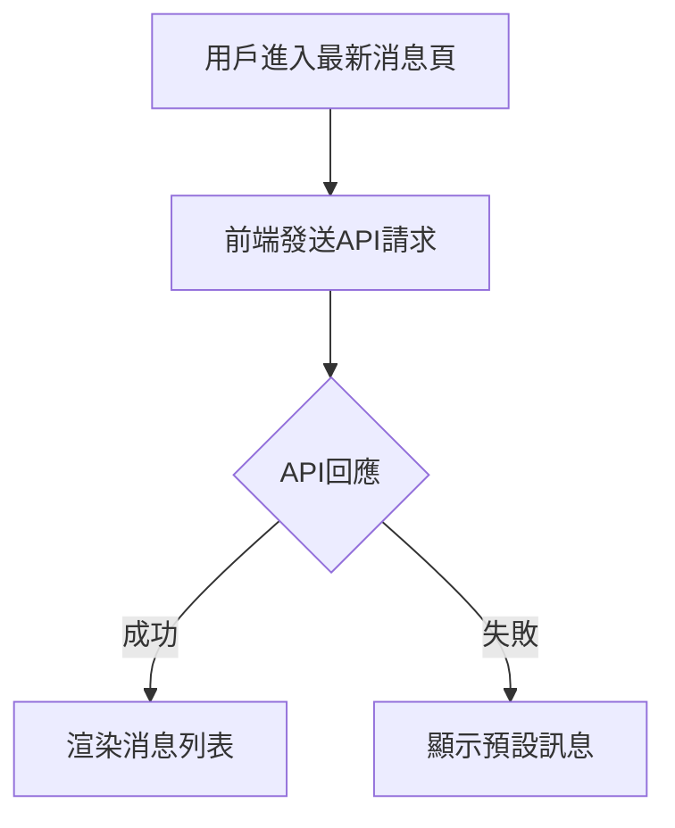
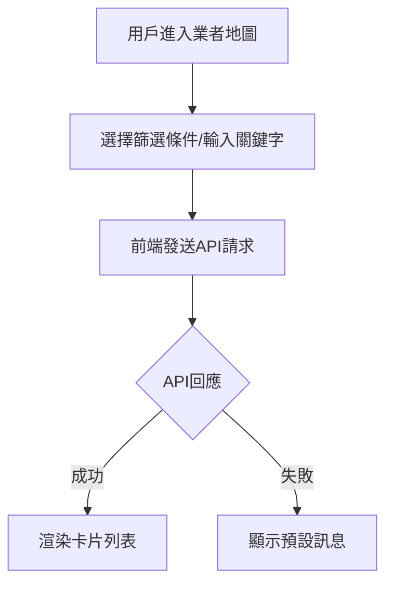

# FRD v1.0 ‧ 2024-06-09

## 版本歷史
| 版本 | 日期       | 說明     | 編寫人         |
|------|------------|----------|----------------|
| 1.0  | 2024-06-09 | 首版制定 | AI 產品策略顧問 |

---

## 1. 功能流程（BPMN）

### 1.1 最新消息流程

### 1.2 業者地圖搜尋流程

---

## 2. 業務規則表

| 功能編號 | 規則編號 | 規則內容                                                         | 對應BRD條款 |
|----------|----------|------------------------------------------------------------------|-------------|
| F-03     | R-03-01  | API 回應失敗時顯示預設訊息                                       | 3.1, 6.3    |
| F-07     | R-07-01  | 篩選條件可多選，預設顯示全部廠商                                 | 3.2         |
| F-07     | R-07-02  | 關鍵字搜尋支援模糊比對                                           | 3.2         |
| F-08     | R-08-01  | 案例卡片內容需包含標題、描述、圖片、連結                         | 3.2         |
| F-09     | R-09-01  | 所有互動元件需有 aria-label，tab index 合理                      | 7           |
| F-09     | R-09-02  | 色彩對比需符合 WCAG 2.0 A 級                                     | 7           |

---

## 3. 驗證邏輯、資料校驗、邊界條件

- API 回應需驗證資料完整性（如標題、描述、日期不可為空）
- 篩選條件若無結果，顯示「查無資料」提示
- 外部連結需檢查格式正確，失效時顯示提示
- 多語系切換時，UI 文字需即時切換

---

## 追溯矩陣
| FRD功能編號 | 來源PRD功能ID | 來源BRD條款 |
|-------------|---------------|-------------|
| F-03        | F-03          | 3.1, 6.3    |
| F-07        | F-07          | 3.2         |
| F-08        | F-08          | 3.2         |
| F-09        | F-09          | 7           |

---

## 簽署確認
| 職稱         | 姓名     | 日期       | 簽名   |
|--------------|----------|------------|--------|
| 產品經理     |          |            |        |
| 技術負責人   |          |            |        |
| UI/UX 設計師 |          |            |        | 