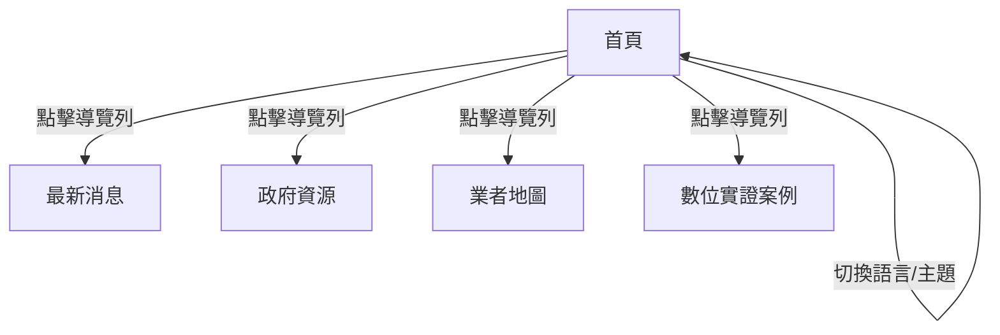

# UI／UX 設計說明 v1.0 ‧ 2024-06-09

## 版本歷史
| 版本 | 日期       | 說明     | 編寫人         |
|------|------------|----------|----------------|
| 1.0  | 2024-06-09 | 首版制定 | AI 產品策略顧問 |

---

## 1. 使用者流程圖


---

## 2. 低保真 Wireframe（首頁、業者地圖頁）

### 首頁
```mermaid
wireframe
  page "首頁" {
    header {
      logo
      nav [最新消息, 政府資源, 業者地圖, 實證案例]
      lang-switch
      theme-switch
      ext-link [AI, GitHub, HuggingFace]
    }
    section {
      hero [三大核心]
    }
    section {
      placeholder [更多內容]
    }
  }
```

### 業者地圖頁
```mermaid
wireframe
  page "業者地圖" {
    header
    section {
      filter [關鍵字, 年度, 工具, 應用, 產業]
      card-list [廠商卡片]
    }
  }
```

---

## 3. 無障礙與設計指導
- 色彩對比：所有文字與背景對比度 ≥ 4.5:1
- tab index：主選單、按鈕、搜尋欄皆可鍵盤操作
- aria-label：所有互動元件皆有語意標籤
- 支援螢幕閱讀器
- 依循 [台灣無障礙規範](https://accessibility.moda.gov.tw/)、WCAG 2.0 A 級

---

## 追溯矩陣
| UI元件/流程 | 來源SRD功能ID |
|-------------|---------------|
| 首頁        | S-01          |
| 導覽列      | S-01          |
| 業者地圖    | S-01          |

---

## 簽署確認
| 職稱         | 姓名     | 日期       | 簽名   |
|--------------|----------|------------|--------|
| 產品經理     |          |            |        |
| 技術負責人   |          |            |        |
| UI/UX 設計師 |          |            |        | 